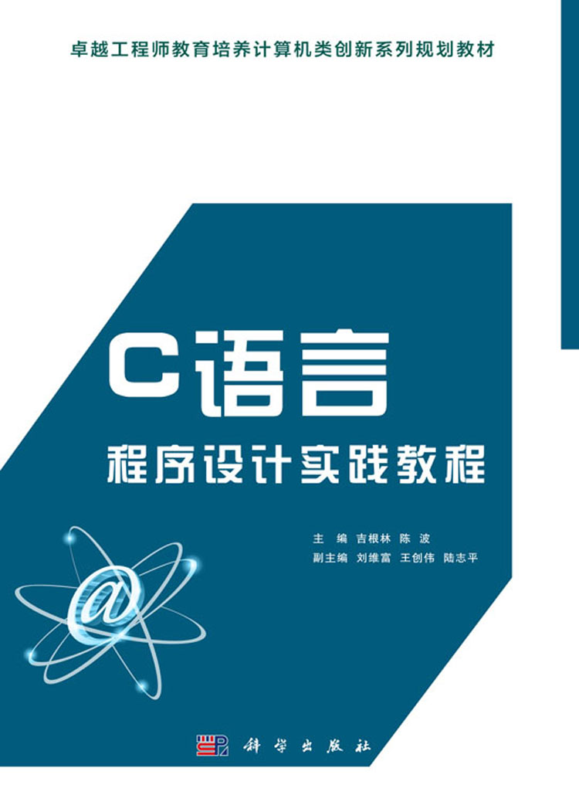
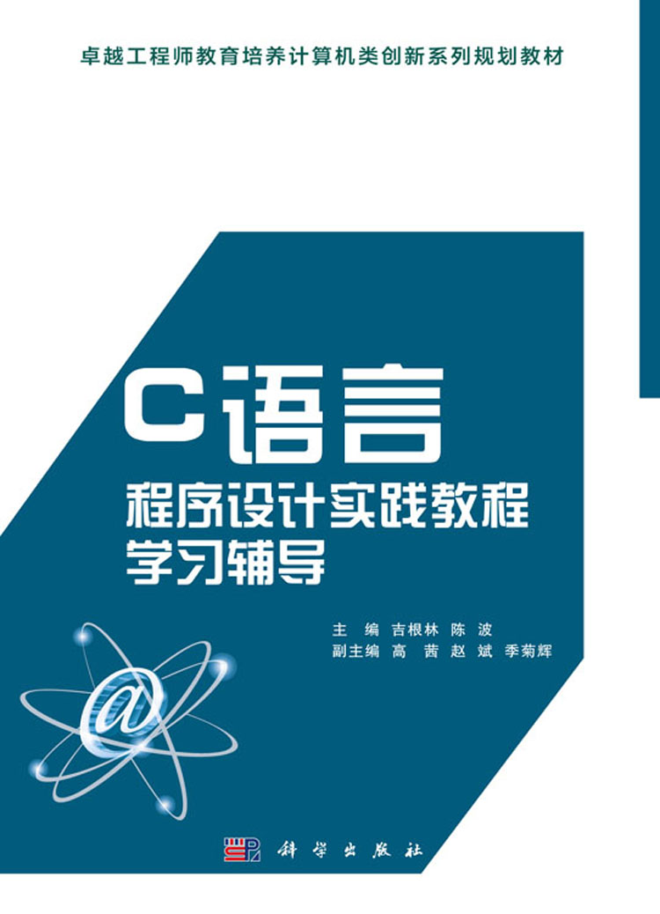

# 期末复习 :shit:

| :new_moon::new_moon::new_moon::new_moon::new_moon::new_moon::waning_gibbous_moon::waxing_gibbous_moon::new_moon::new_moon::new_moon::new_moon::new_moon::new_moon:<br>:new_moon::new_moon::new_moon::new_moon::new_moon::waxing_crescent_moon::waning_gibbous_moon::waxing_gibbous_moon::waning_crescent_moon::new_moon::new_moon::new_moon::new_moon::new_moon:<br>:new_moon::new_moon::new_moon::new_moon::new_moon::first_quarter_moon::waning_gibbous_moon::waxing_gibbous_moon::last_quarter_moon::new_moon::new_moon::new_moon::new_moon::new_moon:<br>:new_moon::new_moon::new_moon::new_moon::new_moon::first_quarter_moon::waning_gibbous_moon::waxing_gibbous_moon::last_quarter_moon::new_moon::new_moon::new_moon::new_moon::new_moon:<br>:new_moon::new_moon::new_moon::new_moon::new_moon::waxing_gibbous_moon::waning_gibbous_moon::waxing_gibbous_moon::waning_gibbous_moon::new_moon::new_moon::new_moon::new_moon::new_moon:<br>:new_moon::new_moon::new_moon::new_moon::waxing_crescent_moon::full_moon::waning_gibbous_moon::waxing_gibbous_moon::full_moon::waning_crescent_moon::new_moon::new_moon::new_moon::new_moon:<br>:new_moon::new_moon::new_moon::new_moon::waxing_gibbous_moon::full_moon::waning_gibbous_moon::waxing_gibbous_moon::full_moon::waning_gibbous_moon::new_moon::new_moon::new_moon::new_moon:<br>:earth_asia::earth_asia::earth_asia::waxing_crescent_moon::full_moon::full_moon::waning_gibbous_moon::waxing_gibbous_moon::full_moon::full_moon::waning_crescent_moon::earth_asia::earth_asia::earth_asia:<br>:earth_asia::earth_asia::earth_asia::full_moon::full_moon::full_moon::waning_gibbous_moon::waxing_gibbous_moon::full_moon::full_moon::full_moon::earth_asia::earth_asia::earth_asia:<br>:earth_asia::earth_asia::earth_asia::full_moon::full_moon::full_moon::new_moon::new_moon::full_moon::full_moon::full_moon::earth_asia::earth_asia::earth_asia:<br>:earth_asia::earth_asia::earth_asia::waning_gibbous_moon::new_moon::new_moon::new_moon::new_moon::new_moon::new_moon::waxing_gibbous_moon::earth_asia::earth_asia::earth_asia: |
|:------------------------------------------------------------------------------------------------------------------------------------------------------------------------------------------------------------------------------------------------------------------------------------------------------------------------------------------------------------------------------------------------------------------------------------------------------------------------------------------------------------------------------------------------------------------------------------------------------------------------------------------------------------------------------------------------------------------------------------------------------------------------------------------------------------------------------------------------------------------------------------------------------------------------------------------------------------------------------------------------------------------------------------------------------------------------------------------------------------------------------------------------------------------------------------------------------------------------------------------------------------------------------------------------------------------------------------------------------------------------------------------------------------------------------------------------------------------------------------------------------------------------------------------------------------------------------------------------------------------------------------------------------------------------------------------------------------------------------------------------------------------------------------------------------------------------------------------------------------------------------------------------------------------------------------------------------------------------------------------------------------------------------------------------------------------------------------------------------:|
|                                                                                                                                                                                                                                                                                                                                                                                                                                                                                                                                                                                                                                                                                                                                                                                                                                                                                                                                                                                                                                    <font size=7>希望期末没事</font>                                                                                                                                                                                                                                                                                                                                                                                                                                                                                                                                                                                                                                                                                                                                                                                                                                                                                                                                                                                                                                    |
## 〇、a++&++a

**1**
```
int k=11; k=1/3*k++;
printf("%d\n", k);
```
```
1
```
**2.**
```
int i = 0;

printf("%d\n", i);
printf("%d\n", i++);
printf("%d\n", ++i);
```

```
0
0
2
```
**3.**
```
int a1, a2, b1, b2;

a1 = 3;
b1 = a1++; // 先将 a1 的值赋给 b1 ，然后 a1 自增 1
printf("a1=%d,b1=%d\n", a1, b1);
a2 = 3;
b2 = ++a2; // 先 a2 先自增 1 ，然后将 a2 的值赋给 b2
printf("a2=%d,b2=%d\n", a2, b2);
```
```
a1=4,b1=3
a2=4,b2=4
```
**4.**
```
int x[10] = { 0, 1, 2, 3, 4, 5, 6, 7, 8, 9 }, *p;

printf("%d\n", (p = x+3, *(p++))); // 逗号表达式
printf("%d\n", (p = x, *(p+4)));
printf("%d\n", (p = x+4, *p++));
printf("%d\n", (p = x+3, *++p));
```

```
3
4
4
4
```
**5.**
```
int a = 4;
int f(int n)
{
	int t = 0;
	static int a = 5;

	if (n%2) {
		int a = 6;
		t += a++;
	}else {
		int a = 7;
		t += a++;
	}
	return (t+a++);
}


int main(void)
{
	int s = a, i = 0;

	for ( ; i < 2; i++)
	{
		s += f(i);
	}
	printf("%d\n", s);
	return (0);
}
```
```
28
```
**6.**
```
int a1, a2, b1, b2, c1, c2;

a1 = 5, b1 = 3;
c1 = a1+b1++;
printf("%d,%d,%d\n", a1, b1, c1);

a2 = 5, b2 = 3;
c2 = a2+++b2; // 与 c2 = a2++ +b2 等价；与 c2 = a2+ ++b2 不等价
printf("%d,%d,%d\n", a2, b2, c2);
```
```
5,4,8
6,3,8
```
**7.**
```
int x = 0, y = 2;

y = --x || ++y; // 考虑优先级；
printf("%d %d", x, y);
```
```
-1 1
```
**8.**
```
int k = 1;

while (k++ < 5);
printf("%d\n", k);
```
```
6
```

## 一、绪论

- C 语言没有输入/输出语句，输入/输出操作是通过函数完成的。
- C 语言 必须经过编译、链接后生成可执行文件，才能运行。
- /\*...\*/ 不可以嵌套。


## 二、数据的基本类型与基本运算
**1.**
```
printf("%f\n", 1/2*(3.0+0.14));
printf("%f\n", 10/3.0*3);
```
```
0.000000
10.000000
```
**2.**
```
int a = 3.6;
printf("%d\n", a);
printf("%f\n", a);
```
```
3
0.000000
```
**3.**
```
char c = 256;
int a = c;
printf("%d\n", a);
```
```
0
```
**4.**
```
int a=5; a+=a-=a*=a;
printf("%d\n", a);
```
```
0
```
**5.**
```
int x = 3;
do
{
        printf("%d ", x = x-3);
} while (!x);
```
```
0 -3
```
**6.**
```
// 若sizeof(int)=4
int a = -1;
printf("%d,%o,%x", a, a, a);
```
```
-1,37777777777,ffffffff
```
**7.**
```
int a=32767,b;
printf("%d",b=++a);
```
```
32768
```
**8.**
```
int a = 8, b = 5;
printf("%d,%d,%d\n", a, b, a %= b += a *= b);
```
```
40,45,40
```
**9.**
```
printf("%d\n", (char)12345);
```
```
57
```
**10.**
```
int a = -1;
printf("%d,%u,%o,%x", a, a, a, a);
```
```
-1,4294967295,37777777777,ffffffff
```
> `-1` 在内存单元中以补码的形式存放:  
> `11111111 11111111 11111111 11111111`  
> 1 Byte == 8 bit
> 1 字节 等于 8 位
>   
>   
>   

- 整型常量 377、 377l 和 377L，它们在内存中分别占用 **4**, **4**, **4** 个字节。
- 整型常量 377.0、 377.0f 和 377.0F，它们在内存中分别占用 **8**, **4**, **4** 个字节。
- int 类型变量可表示的值范围是 ```[-2147483648, 2147483647]```，若有语句 ```int a = 2147483647;```， 则表达式 ```(a+1) == 2147483648``` 的值是 **1**。
- 应避免对实数作相等或不相等的判断。例如对于关系表达式 `1.0/3.0*3.0==1.0` 的结果为假（值为 0）， 实际编程中可以改写为 `fabs(1.0/3.0*3.0-1.0) < 1e-6`。

### 运算符总结
- 除了单目运算符、条件运算符（三目运算符）、赋值运算符，其他都是左结合。
- 设 `struct student{ int  no; char name[12]; float score[3]; } sl, * p = &sl;` 用指针法给sl的成员no赋值1234的语句是 `(*p).no=1234` 或者 `p->no=1234` 。

### 数据类型的转换



## 三、数据的输入/输出

### 输入

- 格式控制串中的 `*` 表示跳过它指定的数据项。  
  例如：
  ```
  int a, b;

  scanf("%d%*d%d", &a, &b);
  printf("%d %d\n", a, b);
  ```
  ```
  1 2 3
  1 3
  ```

## 四、程序的基本结构与基本语句

- 只由分号 `;` 组成的语句成为空语句。
- 算法可以无输入。算法必须有输出。
- 判断闰年： `((year%4 == 0) && (year%100 != 0) || (year%400 == 0))`
- 使用 VC6.0++ 或者 Turbo C 系统编译 C 语言源程序后生成的文件名后缀是 `.obj`

## 五、函数和模块化程序设计

- 在函数调用过程中，如果函数funA调用了函数funB,函数funB又调用了函数funA，则称为函数的间接递归调用  
- 若外部变量与内部变量同名，则外部变量被屏蔽，内部变量起作用。
- 因为外部变量长期占用存储单元，还降低函数的通用性、可靠性、可移植性，容易出错。

### 静态变量和动态扮靓

|          | 类型说明符 | 如何声明     | 种类                                     | 生存周期                                                                                                                                                                            | 初值   |
| -------- | ---------- | ------------ | ---------------------------------------- | ----------------------------------------------------------------------------------------------------------------------------------------------------------------------------------- | ------ |
| 动态变量 | auto       | auto int x   | 局部变量不加存储<br>类型说明都是动态变量 | **函数**开始执行时，分配内存空间；<br>**函数**执行完毕时，系统自动回收动态变量的内存空间。                                                                                           | 随机值 |
| 静态变量 | static     | static int x | :one: 全局变量 <br>:two: 加上 static     | 全局变量，在**程序**开始执行时，系统分配内存空间；<br>为 static 修饰的局部变量，在**所属函数**第一次被调用时，系统分配内存空间；<br> **程序**执行完毕时，系统回收静态变量的内存空间。 | 0      |

### 参数传递
| 两种形式 |     |   |
| --- | --- | --- |
| 传数值   | 常量或表达式<br>基本类型的变量<br>数组元素<br>结构体变量中一个成员的值<br>结构体变量全部成员的值    | 值传递是单向的 <br>形参的值改变了不会影响实参的值|
| 传地址值 <br>（通过指针实现） | 基本类型变量的地址 <br>结构体变量的地址 <br>数组元素的地址 <br>结构体数组元素的地址 | 地址传递是双向的 <br>形参值得改变会影响实参的值 |
```
#include <stdio.h>

int fun(int *q, int *p)
{
	*p = 99;
	p = q;

	return (*p);
}


int main()
{
	int x = 5, y = 90, z = 0;

	y = fun(&z, &x);
	printf("%d\n", x);
	printf("%d\n", y);

	return (0);
}

```
## 六、数组
- 二维数组赋初值，可以缺省第一维的长度。但第二维的长度不能缺省。

### 字符串处理函数

```
strcat(str1, str2) // 连接 返回 str1 首地址
strcpy(str1, str2) // 复制 返回 str1 首地址
strcmp(str1, str2) // 比较 返回 int
strlen(str)        // 长度
```


### 数组名作为函数参数

- 形参若是一维数组，其大小可以不指定；若是二维数组，第一维可以不指定，第二维必须指定。
- 编译时实参的首地址传递给形参，这两个数组共享同一内存空间。


## 七、指针

- 专门存放变量地址的变量叫指针变量。
- 指针变量本身的类型是地址，占2字节。(32位操作系统)
```
printf("%d\n", sizeof(char *)); // 64位
```
```
4
```


### 指针的算数运算
 若有声明```int a[10], *p = a;```  
 1. \*p++ 相当于 \*(p++) ，因为 \* 与 ++ 优先级相同，结合方向为右结合。
 2. \*p++ 与 \*++p 的区别：若 p 的处置为 a，则前者等价于 a[0]，后者等价于 a[1]。
 3. (\*p)++ 表示将 p 指向的变量加 1。

### 指针与二维数组
1. a 是第 0 行的首地址。
2. a+i 是第 i 行的首地址，即 &a[i]，指向行。
3. a[i] 即 \*(a+i)，是第 i 行第 0 列的元素地址，即 &a[i][0]， 指向列。
4. a[i]+j 即 \*(a+i)+j，是第 i 行第 j 列额元素地址。

```
int i, j;
char a[3][4] = { "987", "654", "321" };
char (*p)[4];

p = a;
for (i = 0; i < 3; i++)
{
	for (j = 0; j < 4; j++)
	{
		printf("%c ", *(*(p+i)+j));
	}
	printf("\n");
}
```
```
9 8 7
6 5 4
3 2 1
```

### 指针与字符串数组
```
char str1[10] = "hello c";
char str2[10];
char *pstr1 = "hello c";
char *pstr2;

// str2 = "hello c"; // 错误示范 ，不可以这么写
pstr2 = "hello c";
printf("%s\n", str1);
// printf("%s\n", str2);
printf("%s\n", pstr1);
printf("%s\n", pstr2);
```

|            | 各种类型的指针变量 | 表示的意义                                           |
| ---------- | ------------------ | ---------------------------------------------------- |
| 类型标识符 | *p                 | p 为指向某型变量的指针变量                           |
| 类型标识符 | *p[n]              | p 为指针数组，由 n 个指向某型变量的指针元素组成      |
| 类型标识符 | (*p)[n]            | p 为指向某型二维数组的指针变量，二维数组的列数为 n   |
| 类型标识符 | *p()               | p 为返回指针值的函数，该指针指向某型变               |
| 类型标识符 | (*p)()             | p 为指向函数的指针，该函数返回某型量                 |
| 类型标识符 | **p                | p 为一个指向零一指针的指针变量，该指针指向一个某型量 |


## 八、文件
```
File *fp;

// 打开文件
fp = fopen("aa.c", "w");
if (fp == NULL) {
        printf("File open error!\n");
        exit(0);
}

/* code */

// 关闭文件
fclose(fp);     
```
| 函数       | 输入/输出      |
| ---------- | -------------- |
| 字符读写   | fgetc/fputc    |
| 字符串读写 | fgets/fputs    |
| 格式化读写 | fscanf/fprintf |
| 数据块读写 | fread/fwright  |

**参考文献**  
1. 吉根林, 陈波. C语言程序设计实践教程[M]. 科学出版社, 2016.
2. 吉根林, 陈波. C语言程序设计实践教程学习辅导[M]. 科学出版社, 2018.

<center class="half">
    
</center>
